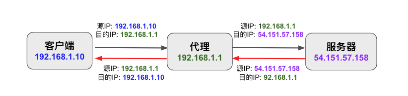

## 什么是透明代理

tproxy 即 transparent（透明） proxy。这里的 transparent（透明）有两层含义：
1. 代理对于 client 是透明的，client 端无需进行任何配置。即无需修改请求地址，也无需采用代理协议和代理服务器进行协商。与之相对比的是 socks 代理或者 http 代理，需要在 client 端设置代理的地址，在发起请求时也需要通过代理协议告知代理服务器其需要访问的真实地址。
2. 代理对于 server 是透明的，server 端看到的是 client 端的地址，而不是 proxy 的地址。

## “非透明”代理

“非透明”代理的请求和响应数据路径如下。可以看到客户端需要在 IP 数据包中把目的 IP 地址指定为代理服务器。

代理需要得到客户端访问的真实目的地，才能正确地转发请求。因此客户端需要通过代理协议将真实地址告知代理服务器。

例如，SOCKS5 协议中，客户端会在协议握手期间向代理服务器发出下面的链接请求：

||VER|CMD|RSV|DSTADDR|DSTPORT|
|---|---|---|---|---|---|
|字节|	1	|1	|1|	Variable|	2| 

## 透明代理

透明代理的请求和响应数据路径如下。客户端的 IP 数据包的目的 IP 地址是其需要访问的真实目的地址。客户端不需要和代理服务器进行握手，就好像直接访问其真实目的地一样。


在透明代理的模式下，由于客户端请求数据包的目的地址不是代理服务器，因此需要通过路由和 iptables 规则将客户端的请求发送给代理服务器处理。

首先将代理服务器设置为客户端的缺省网关，以将请求发送到代理服务器。请求路由到代理服务器后，还需要通过 iptables 将请求重定向到代理进程进行处理。可以有两种办法：

1. 采用 DNAT 将请求重定向到代理进程，这种方式会修改请求 IP 数据包的目的地址和端口。代理服务器收到客户端请求后，可以通过调用 getsockopt 的 SO_ORIGINAL_DST 参数拿到原始请求的目的地址。
2. 采用 TPROXY 来将请求发送到代理进程，这种方式不会修改请求 IP 数据包的目的地址和端口。因此代理服务器可以直接从 socket 中拿到其请求目的地。

采用 TPROXY 模式时，需要路由规则、iptables 和代理进程进行配合。

### 路由规则
由于客户端发出的 IP 数据包的目的地址并不是代理服务器，因此请求缺省会被代理服务器内核 forward 出去。为了能将客户端请求重定向到代理进程，需要在代理服务器上创建下面的策略路由：
```
sudo ip rule add fwmark 1/1 table 1
sudo ip route add local 0.0.0.0/0 dev lo table 1
```
上面的第一行创建了一条策略路由，指定 [fwmark](https://www.linux.org/docs/man8/tc-fw.html) 值为1的 IP 数据包采用路由表1进行路由。

第二行在路由表1中添加了一条路由规则，将所有数据包的下一跳都指向 loopback，这样数据包才能被本地代理进程的 listener 看到。

### iptables
需要在 iptables 的 PREOURTING 链的 mangle 表中对收到的客户端数据包进行处理。

```
sudo iptables -t mangle -A PREROUTING -p tcp -j TPROXY --on-port 12345 --tproxy-mark 1/1
```

`-j TPROXY` 表示采用 TPROXY。

`--on-port 12345` 是代理进程的监听端口。

`--tproxy-mark 1/1` 为 IP 数据包打上一个标记，以应用上面创建的策略路由。

### 应用进程

应用进程必须为监听套接字设置 IP_TRANSPARENT 选项，否则不能监听非 local 的地址。

```c
  int listen_fd = socket(AF_INET, SOCK_STREAM, 0);
  assert(listen_fd != -1);

  int enable = 1;
  assert(setsockopt(listen_fd, SOL_IP, IP_TRANSPARENT, &enable, sizeof(enable)) != -1);
  assert(setsockopt(listen_fd, SOL_SOCKET, SO_REUSEADDR, &enable, sizeof(enable)) != -1);

  struct sockaddr_in bind_addr;
  bind_addr.sin_family = AF_INET;
  bind_addr.sin_port = htons(555);
  inet_pton(AF_INET, "0.0.0.0", &bind_addr.sin_addr);
  assert(bind(listen_fd, (struct sockaddr *)&bind_addr, sizeof(bind_addr)) != -1);

  assert(listen(listen_fd, 128) == 0);

  ......
  ```


## 参考文档
* https://github.com/FarFetchd/simple_tproxy_example/blob/master/tproxy_captive_portal.c
* https://gsoc-blog.ecklm.com/iptables-redirect-vs.-dnat-vs.-tproxy
* https://xtls.github.io/document/level-2/transparent_proxy/transparent_proxy.html
* https://blog.gmem.cc/istio-tproxy
* https://gist.github.com/FH0/9abdd7b73d2c20ee6f3572c1096872f7